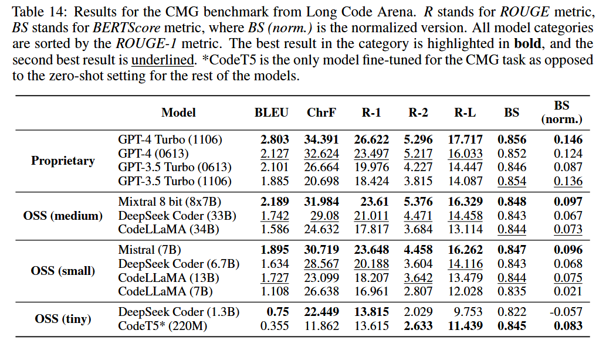

# CMG

## 1. Long code context

### Limitation: 

In CMG, a model should generate a natural language description of changes performed in a single commit. The changes can be represented in different ways --- in various diff formats, as seperate versions of each file before and after the changes took place, and others.  Moreover, models can utilize information from unchanged project files to better understand how changes impacted the project. **However, researchers often limit the scope to short diffs[1], leaving the performance on larger commits unexplored.**

### Benchmark & baselines

Dataset: A sample from CommitChronicle that contains 163 commits from 34 repositories.

Metrics: BLEU, ROUGE, ChrF, and BERTScore.

Baselines: Mixtral-8x7B, Mixtral-7B, DeepSeek Coder, CodeLLaMA, fine-tuned CodeT5.

[1] From commit message generation to history-aware commit message completion.

## TODO:

- 确认已有数据集是否是多文件的
- 复现已有模型
- CCT5复现：下载数据、复现

## 2. History commits

在代码commit message自动生成领域，结合历史commit messages作为模型的输入是一种有效的增强方法。这种方法利用了开发者的编码习惯和项目的语言风格。然而，你在实验中发现，直接使用所有历史commit messages作为输入并不总是有利，反而通过检索最相似的diff，并仅选择top-k个相似的diff的历史commit messages作为额外输入，能提高效果。这一现象背后可能有以下几个原因：

### 1. **信息冗余与噪声过滤**
   
   在直接使用所有历史commit messages作为输入时，可能包含大量与当前diff不相关的历史信息。这些无关或低相关性的历史commit messages会增加模型的学习负担，引入噪声，降低模型的生成质量。通过检索最相似的diff，并只选择top-k个相似的diff的历史commit messages，你有效地过滤掉了这些不相关的噪声，使得模型能专注于更相关的信息，提高生成效果。

### 2. **语义匹配与上下文关联**
   
   相似的diff通常意味着相似的代码更改和上下文语义。通过选择最相似的diff及其对应的历史commit messages，模型可以获取更准确、更有针对性的上下文信息。这些信息对于生成具有语义关联性更强的commit message至关重要。相似性越高，历史commit message的结构和语言模式可能越接近当前的需求，从而提升了生成质量。

### 3. **模型复杂度的控制**
   
   当输入的历史commit messages过多时，模型需要处理的上下文信息会变得非常复杂，这可能导致信息超载和泛化能力的下降。通过限制输入为top-k相似的diff及其历史commit messages，你在一定程度上降低了模型的输入复杂度，使得模型能够更有效地聚焦在相关信息上，提升了性能。

### 改进建议

1. **动态K值选择**：
   可以考虑动态调整top-k的值，而不是固定k值。具体可以基于diff的复杂度或diff与历史commit messages的相似度分布来调整k值，确保输入信息的最优相关性。

2. **语义相似度增强**：
   目前的方法可能基于一些基本的相似度度量（如编辑距离、n-gram相似度等），可以尝试利用预训练语言模型（如BERT、CodeBERT）来计算更高维度的语义相似度，这可能会更准确地捕捉diff之间的语义关联。

3. **多模态融合**：
   除了使用历史commit messages，还可以引入代码上下文（如文件名、类名、函数名、上下文代码段等）作为额外输入，结合多模态的信息进一步提升生成效果。

4. **噪声模型**：
   引入噪声模型来识别和过滤掉那些不相关或可能引入错误信息的历史commit messages。这种方法可以进一步提高输入信息的质量。

### 未来研究方向

1. **历史信息的权重调整**：
   探索自动学习不同历史commit messages的权重，使得模型能够动态调整每个历史commit message对当前生成任务的贡献。

2. **时序信息的利用**：
   当前研究大多将历史commit messages视为无序的集合。可以探索如何利用这些commit messages的时序信息（如先后顺序、依赖关系）来进一步优化生成结果。

3. **跨项目迁移学习**：
   研究如何将一个项目中的commit message生成模型迁移到另一个项目中，特别是在项目历史数据不足的情况下，如何有效利用外部项目的相似diff及其历史commit messages来辅助生成。

4. **用户个性化模型**：
   开发者的语言风格和习惯通常是个人化的，可以探索构建个性化的commit message生成模型，根据每个开发者的历史commit messages单独训练模型，从而提高个性化生成的效果。

5. **长期依赖的建模**：
   探索如何在生成commit message时更好地利用长期依赖关系，特别是在大型项目或复杂代码更改中，捕捉跨多次commit之间的逻辑和语义关联。

综上所述，使用相似的diff及其历史commit messages作为额外输入，能够有效减少噪声、增强语义匹配，并且控制模型的复杂度，从而提升commit message的生成质量。通过进一步优化输入选择、引入多模态信息、以及探索更复杂的模型结构，可以继续推动这一研究领域的发展。